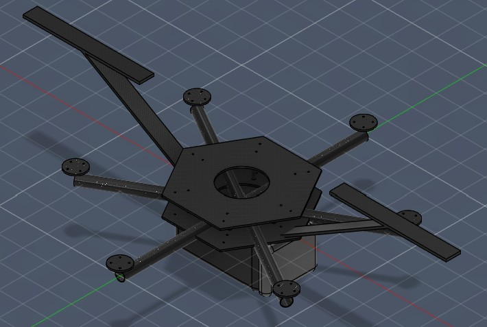
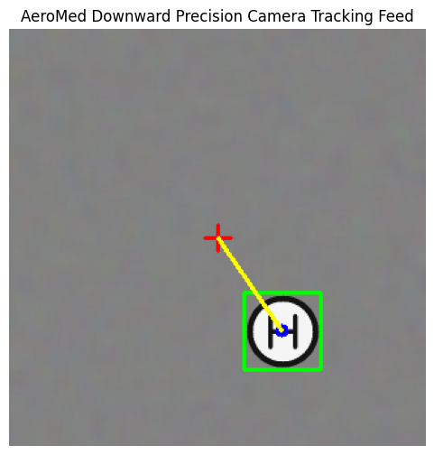

# Joshua Oluku
### Mechatronics Engineering Student | University of Nigeria, Nsukka
[LinkedIn](https://www.linkedin.com/in/joshua-oluku-348ba1294/) | [GitHub](https://github.com/SkulboiQ)

---

## 💡 Professional Overview
Fourth-year Mechatronics Engineering student at the University of Nigeria, Nsukka, serving as General Secretary for the UNN Mechatronics Club. Focused on the structural optimization of mechatronic assemblies, CAD/CAM pipelines, and the execution of automated software layers through AI-assisted rapid prototyping (Vibe Coding). I specialize in bridging the gap between physical mechanics and digital control loop architectures.

---

## 🚀 Featured Engineering Projects

### 🛸 1. AeroMed Heavy-Lift UAV (Digital Twin & Autonomy Pipeline)
An autonomous heavy-lift medical delivery drone designed to bypass critical logistical bottlenecks and transport sensitive packages (2–3kg payloads).

#### 📐 Core Structural Assembly (Autodesk Fusion 360)

#### 📝 The Engineering Design Process & Iteration Log

To ensure structural integrity and operational safety under a heavy dynamic payload, the design was executed through a rigorous 4-stage engineering lifecycle:

1. **Stage 1: Structural Layout & Mass Optimization**
   * *Problem:* Heavy-lift systems require maximum structural rigidity without penalizing airtime via dead weight.
   * *Solution:* Engineered a dual-plate regular hexagonal frame with a 240mm diameter footprint using 3mm carbon fiber plates. To optimize strength-to-weight ratio, a 100mm central weight-reduction pocket was cut from the bottom plate, and a smaller 80mm pocket was placed on the top plate for stack access, reducing overall chassis plate mass by over 20% while retaining structural stiffness. The plates are rigidly braced via 6× 6061-T6 aluminum standoffs sitting at a precise 65mm radial boundary.
2. **Stage 2: Propulsion Vectoring & Vibration Isolation**
   * *Problem:* Motor torque and high-speed propeller rotations introduce high-frequency harmonic vibrations that disrupt flight controller IMUs and cause camera jitter.
   * *Solution:* Distributed 6× hollow carbon fiber arms (20mm OD / 18mm ID with a rigid 1mm structural wall) at exact 60° configurations. The arms sit perfectly aligned with the Z-axis midpoint of the chassis gap (Z=20.5mm) to distribute torsional loads evenly. Standardized 40mm diameter aluminum motor mounting discs with a universal 19x19mm square bolt grid were integrated at the arm tips ($R=250\text{mm}$) to handle high-torque brushless motors.
3. **Stage 3: Aerodynamic Evaluation & Fuselage Modification (Critical Iteration)**
   * *Problem:* Initial prototype layouts utilized an open-faced (+X normal) horizontal cargo pod for easy medical kit insertion. However, aerodynamic analysis revealed that when the hexacopter pitches downward during forward high-velocity flight, the open face acts as an "air scoop," creating massive drag, aerodynamic flow separation, and critical battery depletion.
   * *Solution:* Iterated the design by engineering a custom, mating **Payload Hatch Base** extending 15mm forward. Applied a 10mm aerodynamic fillet to the nose outer boundary to form a sleek, low-drag nose dome. This completely seals the pod, drops the drag coefficient ($C_d$), and shields the cargo from harsh environmental exposure.
4. **Stage 4: Ground Clearance & Landing Stability**
   * *Problem:* The drone requires a wide, tip-resistant stance during autonomous touchdowns, with a built-in safety clearance buffer for the underslung cargo.
   * *Solution:* Designed symmetric dual landing gear legs splayed outward at 60° from vertical down to a depth of $Z=-130\text{mm}$, terminating in 240mm long ground contact rails. This provides a rock-solid footprint that cleanly straddles the 110mm-wide payload pod while leaving an exact 40mm structural ground clearance buffer beneath the pod base.

#### 🧠 Real-Time Vision Tracking Loop (YOLOv8 Nano & PyMAVLink)

* **Autonomy & Systems Integration (AI-Assisted):** Leveraged advanced generative AI toolchains to rapidly build and deploy a functional real-time computer vision landing sequence. Programmed an automated synthetic dataset generation engine inside Google Colab via OpenCV, trained a lightweight **YOLOv8 Nano** model at $320\times320$ resolution to fit edge-hardware constraints, and established a proportional control tracking script converting pixel errors ($E_x, E_y$) into physical velocity vectors ($V_x, V_y$) transmitted via **PyMAVLink** to a Pixhawk autopilot.
* **Tools Used:** `Autodesk Fusion` `YOLOv8` `OpenCV` `Python` `PyMAVLink` `Google Colab`

---

## 🛠️ Core Technical Competencies

* **Mechanical & Architectural Design:** Parametric/Hybrid 3D Assembly Modeling, Weight-Reduction Topology Optimization, Aerodynamic Body Design, Fusion 360, SolidWorks.
* **Systems Integration & Controls:** AI-Assisted Rapid Software Prototyping (Vibe Coding), Real-Time Edge Computer Vision Deployment, Autopilot Telemetry Interfaces (MAVLink protocol).
* **Leadership & Operations:** Technical Project Architecture, System Documentation, Strategic Brand Sponsorship Negotiations, General Secretary (Mechatronics Club UNN).

---

## 👔 Leadership & Professional Milestones

### **General Secretary** — Mechatronics Club, University of Nigeria, Nsukka
*June 2025 — Present*
* Managed administrative operations, core team coordination, and official correspondence for the engineering club student body.
* Formulated, managed, and executed the 2-day national career webinar *"Navigating Internships, Career Growth & Life After School"*, handling technical speaker onboarding and organizing cross-department advertising.
* Negotiated brand visibility terms and strategic agreements with corporate tech sponsors to maximize club event recognition.
